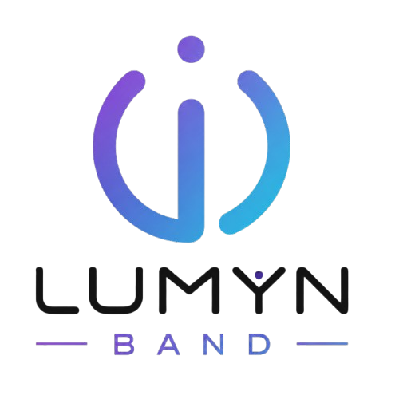
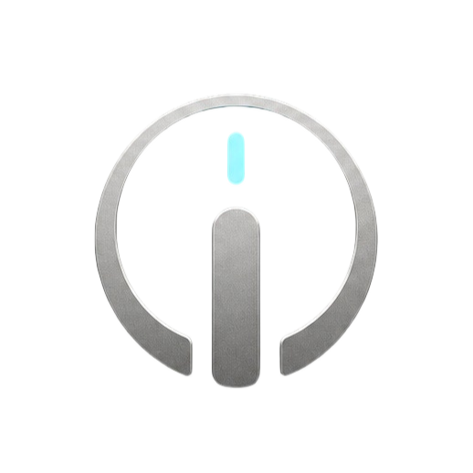
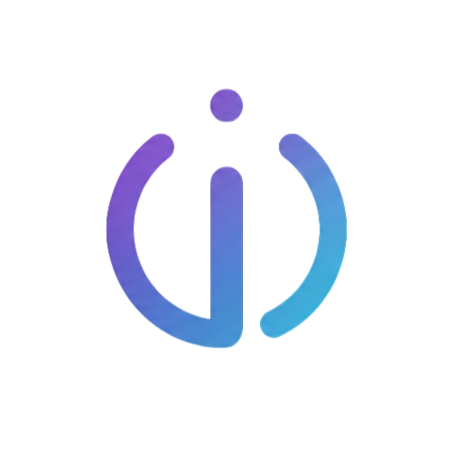

<div align="center">

<!--  -->


# LUMYN BAND

### *Intelligent Neurotechnology Wearable Platform*

Brain • Heart • Motion • Intelligence

<br>


<br>


<br>


<br>


<br><br>

*"Transforming brain activity into meaningful insights through intelligent wearable technology."*

</div>

---

# 🧠 What is Lumyn?

**Lumyn Band** is an open-source wearable neurotechnology platform designed to monitor, analyze, and understand human physiological signals in real time.

Built around modern embedded systems, digital signal processing, and Bluetooth Low Energy, Lumyn combines multiple sensing technologies into a compact wearable capable of measuring:

- 🧠 Brain Activity (EEG)
- ❤️ Heart Rate
- 💓 Heart Rate Variability (HRV)
- 🩸 Blood Oxygen (SpO₂)
- 🚶 Motion & Orientation
- 📈 Real-Time Neuro Analytics

Unlike traditional health wearables that focus on a single sensor, Lumyn is designed as a **multi-modal sensing platform**, combining neurological and physiological data into one intelligent system.

Its modular architecture allows researchers, students, developers, and makers to explore wearable neurotechnology without being locked into proprietary ecosystems.

---

# ✨ Vision

> **To build an open, extensible, and intelligent wearable platform that bridges neuroscience, embedded systems, and modern software engineering—empowering innovation in personal health, research, and human-computer interaction.**

---

# 🚀 Key Features

<table>
<tr>
<td width="50%" valign="top">

## 🧠 Neurotechnology

- EEG Acquisition
- Digital Signal Processing
- FFT Analysis
- Alpha / Beta / Theta Bands
- Gamma & Delta Waves
- Blink Detection
- Brain Activity Streaming
- Neurofeedback Support

</td>

<td width="50%" valign="top">

## ❤️ Health Monitoring

- Heart Rate
- HRV
- Blood Oxygen (SpO₂)
- Motion Tracking
- Activity Monitoring
- Sleep Research Ready
- Sensor Fusion
- Real-Time Metrics

</td>
</tr>
</table>

---

<table>
<tr>
<td width="50%" valign="top">

## 📡 Connectivity

- Bluetooth Low Energy
- OTA Firmware Updates
- Live Data Streaming
- Mobile Integration
- Desktop Dashboard
- Cross Platform Support

</td>

<td width="50%" valign="top">

## ⚙️ Firmware

- Modular Architecture
- Hardware Abstraction Layer
- Cooperative Scheduler
- Event Driven Design
- Logging System
- Storage Framework
- Battery Management
- Future RTOS Ready

</td>
</tr>
</table>

---

# 🏗 System Architecture

```text
                     LUMYN ECOSYSTEM

             ┌──────────────────────────┐
             │      Mobile App          │
             └────────────▲─────────────┘
                          │ BLE
                          │
             ┌────────────┴─────────────┐
             │     Lumyn Firmware       │
             ├──────────────────────────┤
             │       Application        │
             ├──────────────────────────┤
             │      Core Services       │
             ├──────────────────────────┤
             │    Feature Modules       │
             ├──────────────────────────┤
             │ Hardware Abstraction     │
             ├──────────────────────────┤
             │ Platform Drivers         │
             └────────────▲─────────────┘
                          │
                          │
        ┌─────────────────┼─────────────────┐
        │                 │                 │
      BioAmp          MAX30102           IMU
        │                 │                 │
        └─────────────────┼─────────────────┘
                          │
                    XIAO nRF52840
```

---

# 🧩 Repository Structure

```text
Lumyn/
│
├── docs/                    → Complete project documentation
│   ├── ARCHITECTURE.md
│   ├── ArchSection/
│   ├── API.md
│   ├── diagrams/
│   └── assets/
│
├── firmware/                → Embedded firmware
│   ├── src/
│   ├── include/
│   ├── lib/
│   ├── test/
│   └── platformio.ini
│
├── hardware/                → Hardware development
│   ├── pcb/
│   ├── schematics/
│   ├── enclosure/
│   ├── bom/
│   └── manufacturing/
│
├── backend/                 → Cloud backend
│
├── frontend/
│   ├── web/
│   └── shared/
│
├── mobile/
│
├── ai/
│
├── tools/
│
├── LICENSE
├── README.md
└── CHANGELOG.md
```

---

# 🛠 Project Components

<table>
<tr>
<td align="center" width="20%">

## 🧠 Hardware

Custom wearable electronics built around modern sensors and ultra-low-power embedded hardware.

</td>

<td align="center" width="20%">

## ⚙️ Firmware

Modular C++ firmware built with PlatformIO following layered architecture principles.

</td>

<td align="center" width="20%">

## 🌐 Web

A browser-based dashboard for visualization, analytics, firmware management, and device monitoring.

</td>

<td align="center" width="20%">

## 📱 Mobile

A cross-platform companion application for BLE communication, live monitoring, and session management.

</td>

<td align="center" width="20%">

## ☁ Backend

Cloud infrastructure powering authentication, synchronization, analytics, OTA delivery, and future AI services.

</td>

</tr>
</table>

---

# 📖 Documentation

Comprehensive documentation is provided to make every aspect of the project understandable and maintainable.

| Document | Description |
|----------|-------------|
| 📘 **Architecture** | Complete firmware architecture documentation |
| 🧠 **Hardware Guide** | PCB, schematics, sensors, and electrical design |
| 📡 **BLE Protocol** | Bluetooth services and communication protocol |
| 📚 **API Reference** | Public firmware interfaces |
| 📝 **Developer Guide** | Coding standards and contribution workflow |

---

# ⚙️ Platform Components

The Lumyn ecosystem is designed as a **complete neurotechnology platform**, consisting of embedded firmware, wearable hardware, companion applications, cloud services, and intelligent data processing.

Each component is developed independently while remaining tightly integrated through well-defined interfaces and communication protocols.

---

# 🛠 Hardware

<div align="center">

<!--  -->


### Wearable Neurotechnology Device

</div>

The Lumyn hardware is a compact wearable device engineered for **continuous physiological monitoring**, **real-time signal processing**, and **wireless connectivity**.

It combines multiple biomedical sensors with a powerful low-energy microcontroller to deliver accurate measurements while maintaining low power consumption and long battery life.

---

## Core Hardware Components

| Component | Description |
|-----------|-------------|
| 🧠 BioAmp EXG Pill | EEG signal acquisition |
| ❤️ MAX30102 | Heart Rate & SpO₂ Sensor |
| 🚶 IMU | Motion & Orientation Detection |
| ⚡ Seeed Studio XIAO nRF52840 Sense | Main MCU & BLE Communication |
| 🔋 Li-Po Battery | Portable Power Source |
| 🔌 USB-C | Charging & Firmware Upload |
| 📺 OLED Display | Device Status & User Interface |
| 📳 Vibration Motor | Haptic Feedback |
| 💾 Flash Storage | Session Recording & Configuration |

---

## Hardware Features

- 🧠 Real-time EEG acquisition
- ❤️ Continuous heart rate monitoring
- 🩸 Blood oxygen (SpO₂) estimation
- 🚶 Motion & activity tracking
- 📶 Bluetooth Low Energy connectivity
- 📺 OLED status display
- 📳 Haptic notifications
- 🔋 Intelligent battery management
- ⚡ USB-C charging
- 💾 On-device session storage
- 🌙 Ultra-low power operation
- 🔄 OTA firmware updates

---

## Hardware Roadmap

| Status | Feature |
|--------|---------|
| ✅ | Prototype PCB |
| ✅ | EEG Integration |
| ✅ | BLE Connectivity |
| 🚧 | Production PCB |
| 🚧 | Injection Molded Enclosure |
| 🚧 | Waterproof Design |
| ⬜ | Medical-grade Electrodes |
| ⬜ | Wireless Charging |
| ⬜ | Docking Station |

---

# 💻 Firmware

<div align="center">

<!--  -->


### Embedded Intelligence

</div>

The Lumyn firmware is the core software powering the wearable device.

Built with **PlatformIO**, **Modern C++**, and a modular architecture, the firmware is responsible for sensor acquisition, digital signal processing, communication, storage, power management, and user interaction.

The firmware is designed to be **portable**, **maintainable**, and **scalable**, allowing support for multiple hardware platforms while sharing a common codebase.

---

## Firmware Architecture

```text
Application Layer
        │
        ▼
Core Services
        │
        ▼
Feature Modules
        │
        ▼
Hardware Abstraction Layer
        │
        ▼
Platform Drivers
        │
        ▼
Physical Hardware
```

---

## Core Firmware Modules

| Module | Responsibility |
|---------|----------------|
| 🧠 Sensor Manager | Sensor initialization & acquisition |
| 📊 DSP Engine | Signal filtering & FFT |
| 📶 BLE Manager | Wireless communication |
| 📺 Display Manager | OLED rendering |
| 🔋 Battery Manager | Battery monitoring |
| 💾 Storage Manager | Session recording |
| 🔄 OTA Manager | Firmware updates |
| ⚙️ Scheduler | Cooperative task execution |
| 📜 Logger | Runtime diagnostics |
| 📢 Event Bus | Inter-module communication |

---

## Firmware Highlights

- Modular Architecture
- Hardware Abstraction Layer
- Cooperative Scheduler
- Event-driven Design
- Digital Signal Processing
- BLE GATT Services
- Session Recording
- OTA Updates
- Low Power Modes
- Cross-platform Support
- Extensive Logging
- Easy Hardware Portability

---

## Supported Platforms

| Platform | Status |
|----------|--------|
| ✅ Seeed Studio XIAO nRF52840 Sense | Primary Platform |
| ✅ Arduino UNO R4 WiFi | Development Platform |
| 🚧 ESP32-S3 | Planned |
| ⬜ STM32 | Future Support |

---

# ☁️ Backend

<div align="center">

🌐 **Cloud Infrastructure**

</div>

The backend provides secure cloud services for user authentication, data synchronization, analytics, firmware distribution, and future AI-powered insights.

Although the current focus is embedded firmware development, the backend architecture has been planned to support a scalable ecosystem.

---

## Planned Services

- 🔐 Authentication
- ☁️ Cloud Synchronization
- 📈 Health Analytics
- 📊 Dashboard APIs
- 📦 OTA Distribution
- 🔔 Push Notifications
- 📁 Secure Session Storage
- 🤖 AI Inference APIs

---

## Planned Technology Stack

| Technology | Purpose |
|------------|---------|
| FastAPI | REST API |
| PostgreSQL | Primary Database |
| Supabase | Authentication & Storage |
| Redis | Caching |
| Docker | Containerization |
| Nginx | Reverse Proxy |

---

# 🌐 Web Dashboard

<div align="center">

🖥 **Browser-based Control Center**

</div>

The Lumyn Web Dashboard will provide a powerful interface for viewing live data, managing devices, analyzing recorded sessions, and configuring wearable settings.

Designed with responsiveness and usability in mind, it will function as the primary desktop interface for the Lumyn ecosystem.

---

## Planned Features

- 📊 Live EEG Visualization
- ❤️ Heart Rate Dashboard
- 🩸 SpO₂ Monitoring
- 🚶 Motion Analytics
- 📈 Historical Trends
- 💾 Session Management
- ⚙️ Device Configuration
- 🔄 OTA Firmware Updates
- 📥 Data Export
- 👤 User Profiles

---

## Planned Technology Stack

| Technology | Purpose |
|------------|---------|
| React | Frontend Framework |
| TypeScript | Application Logic |
| Tailwind CSS | UI Styling |
| Recharts | Data Visualization |
| Web Bluetooth | Device Communication |

---

# 📱 Mobile Application

<div align="center">

📲 **Companion App**

</div>

The Lumyn mobile application will allow users to interact with their wearable in real time, providing live monitoring, personalized insights, session management, and firmware updates directly from their smartphone.

Designed for simplicity and reliability, it will become the primary user interface for everyday use.

---

## Planned Features

- 📶 BLE Device Pairing
- 📊 Live Physiological Data
- 🧠 Brain Activity Monitoring
- ❤️ Heart Rate Tracking
- 🩸 SpO₂ Monitoring
- 📁 Session History
- ☁️ Cloud Synchronization
- 🔔 Smart Notifications
- 🔄 OTA Firmware Updates
- ⚙️ Device Configuration

---

## Planned Technology Stack

| Technology | Purpose |
|------------|---------|
| Flutter | Cross-platform Development |
| Dart | Application Language |
| Bluetooth Low Energy | Device Communication |
| Firebase Messaging | Push Notifications |
| REST API | Cloud Integration |

---

# 🤖 AI & Signal Intelligence

<div align="center">

🧠 **From Raw Signals to Meaningful Insights**

</div>

Lumyn is being designed not only as a data acquisition device but also as an intelligent platform capable of transforming raw physiological signals into actionable insights.

Future releases will introduce machine learning and signal analysis techniques to enhance the user experience while maintaining privacy and efficiency.

---

## Planned Capabilities

- 🧠 Brainwave Classification
- 🎯 Focus Estimation
- 😌 Relaxation Detection
- 😴 Sleep Analysis
- 😵 Fatigue Detection
- 📈 Personalized Baselines
- 🤖 TinyML On-device Inference
- ☁️ Cloud-assisted AI Models
- 📊 Long-term Trend Analysis
- 💡 Personalized Recommendations

---

## Design Philosophy

The AI pipeline will prioritize:

- Privacy-first processing
- Explainable insights
- Efficient edge inference
- Minimal battery impact
- Secure cloud synchronization
- Modular model deployment
- Continuous improvement through user feedback

Rather than replacing user understanding, Lumyn's intelligence is intended to augment it—turning complex physiological signals into clear, meaningful information that supports healthier habits and better self-awareness.

---

# ⚡ Technology Stack

<div align="center">

The Lumyn ecosystem combines modern embedded systems, cloud technologies, and cross-platform applications into a unified neurotechnology platform.

</div>

<br>

## 🧩 Hardware

| Category | Technology |
|-----------|------------|
| Microcontroller | Seeed Studio XIAO nRF52840 Sense |
| Alternative Platform | Arduino UNO R4 WiFi |
| EEG Sensor | BioAmp EXG Pill |
| Heart Rate & SpO₂ | MAX30102 |
| Motion Sensor | Onboard IMU |
| Display | SSD1306 OLED |
| Connectivity | Bluetooth Low Energy 5.0 |
| Power | Li-ion Battery |
| Charging | USB-C |
| Storage | Internal Flash Memory |

---

## 💻 Firmware

| Category | Technology |
|-----------|------------|
| Language | Modern C++17 |
| Framework | Arduino Framework |
| Build System | PlatformIO |
| Architecture | Modular Layered Architecture |
| Communication | BLE GATT |
| Scheduling | Cooperative Task Scheduler |
| DSP | Custom Signal Processing Engine |
| OTA | Planned |
| Storage | Flash / LittleFS |

---

## 🌐 Backend

> 🚧 Under Active Development

| Category | Planned Technology |
|-----------|--------------------|
| API | FastAPI |
| Database | PostgreSQL |
| ORM | SQLAlchemy |
| Authentication | JWT / OAuth |
| Storage | Cloud Object Storage |
| Deployment | Docker |

---

## 🖥 Web Dashboard

> 🚧 Under Active Development

| Category | Planned Technology |
|-----------|--------------------|
| Framework | Next.js |
| UI | React |
| Styling | Tailwind CSS |
| Charts | Recharts |
| Communication | BLE + REST API |
| Authentication | OAuth |

---

## 📱 Mobile Application

> 🚧 Under Active Development

| Category | Planned Technology |
|-----------|--------------------|
| Framework | Flutter |
| Platforms | Android & iOS |
| BLE | Flutter Blue Plus |
| State Management | Riverpod |
| Charts | FL Chart |

---

## 🧠 Artificial Intelligence

> 🚧 Future Roadmap

| Feature | Status |
|----------|--------|
| TinyML | Planned |
| Focus Detection | Planned |
| Stress Detection | Planned |
| Meditation Analysis | Planned |
| Personalized Insights | Planned |
| Predictive Analytics | Planned |

---

# 📚 Documentation

<div align="center">

Comprehensive documentation is available for every subsystem of the Lumyn platform.

</div>

<br>

| Document | Description |
|----------|-------------|
| 📖 README.md | Project Overview |
| 🏗 ARCHITECTURE.md | Firmware Architecture |
| 📡 BLE Protocol | Communication Protocol |
| 🧠 DSP Documentation | Signal Processing |
| 🔌 Hardware Guide | PCB & Electronics |
| 📦 API Reference | Firmware APIs |
| ⚙ Platform Support | Supported Boards |

---

# 🚀 Getting Started

## Clone the Repository

```bash
git clone https://github.com/anurag-panda-dev/LUMYN.git
cd Lumyn
```

---

## Open Firmware

```bash
cd firmware
code .
```

---

## Build

```bash
pio run
```

---

## Upload

```bash
pio run --target upload
```

---

## Monitor

```bash
pio device monitor
```

---

# 🗺 Development Roadmap

<div align="center">

The Lumyn platform is continuously evolving.

</div>

<br>

## Phase 1 — Firmware Foundation

- [x] Modular Firmware Architecture
- [x] Layered Design
- [x] PlatformIO Support
- [x] Scheduler
- [x] Hardware Abstraction Layer
- [x] Sensor Drivers
- [x] BLE Communication
- [ ] DSP Engine
- [ ] Storage System
- [ ] OTA Updates

---

## Phase 2 — Companion Applications

- [ ] Mobile Application
- [ ] Web Dashboard
- [ ] Device Pairing
- [ ] Session Recording
- [ ] Analytics Dashboard

---

## Phase 3 — Cloud Platform

- [ ] REST API
- [ ] User Accounts
- [ ] Session Sync
- [ ] Secure Authentication
- [ ] Cloud Storage

---

## Phase 4 — AI Platform

- [ ] TinyML Integration
- [ ] Focus Estimation
- [ ] Stress Detection
- [ ] Sleep Analytics
- [ ] Personalized Recommendations
- [ ] Intelligent Neurofeedback

---

# 🤝 Contributing

Contributions are welcome and appreciated. Whether you're improving firmware performance, designing PCB revisions, enhancing documentation, fixing bugs, or proposing new features, every contribution helps move the Lumyn ecosystem forward.

We encourage contributions from:

- 🧠 Embedded Systems Engineers
- 📱 Mobile Developers
- 🌐 Full Stack Developers
- ⚡ Electronics Engineers
- 🎨 UI/UX Designers
- 🤖 AI & Machine Learning Engineers
- 📖 Technical Writers
- 🧪 Test Engineers
- 🔒 Security Researchers
- ❤️ Open Source Contributors

---

## Contribution Workflow

```text
Fork Repository
       │
       ▼
Create Feature Branch
       │
       ▼
Develop & Test
       │
       ▼
Commit Changes
       │
       ▼
Push Branch
       │
       ▼
Open Pull Request
       │
       ▼
Code Review
       │
       ▼
Merge
```

---

## Development Guidelines

Please follow the project's engineering standards.

- Write clean and readable code.
- Keep modules independent.
- Follow the repository architecture.
- Use descriptive commit messages.
- Document public APIs.
- Add tests whenever applicable.
- Avoid unnecessary dependencies.
- Keep pull requests focused on a single feature or fix.

---

## Reporting Issues

Found a bug?

Please include:

- Device model
- Firmware version
- Hardware revision
- Steps to reproduce
- Expected behavior
- Actual behavior
- Debug logs
- Photos (if hardware related)

---

# 💬 Community

Join the Lumyn community to discuss development, report issues, suggest features, and collaborate on future innovations.

| Platform | Purpose |
|-----------|---------|
| GitHub Discussions | Questions & Community Support |
| GitHub Issues | Bug Reports |
| Pull Requests | Code Contributions |
| Discord *(Coming Soon)* | Community Chat |
| Documentation | Technical Reference |

---

# 🗺 Roadmap

The Lumyn platform is being developed in multiple phases.

---

## Phase 1 — Firmware Foundation

- ✅ Project Architecture
- ✅ Repository Structure
- ✅ Hardware Abstraction Layer
- ✅ Scheduler
- ✅ Task Management
- ✅ Driver Framework
- ✅ Logger
- ✅ Configuration System

---

## Phase 2 — Hardware Integration

- ⏳ BioAmp EXG Integration
- ⏳ MAX30102 Driver
- ⏳ IMU Driver
- ⏳ Battery Management
- ⏳ OLED Interface
- ⏳ Haptic Feedback

---

## Phase 3 — Signal Processing

- ⏳ EEG Filtering
- ⏳ FFT Analysis
- ⏳ Brainwave Detection
- ⏳ Blink Detection
- ⏳ Heart Rate Processing
- ⏳ Sensor Fusion

---

## Phase 4 — Connectivity

- ⏳ BLE Protocol
- ⏳ Mobile Communication
- ⏳ OTA Updates
- ⏳ Device Configuration
- ⏳ Session Streaming

---

## Phase 5 — Companion Applications

- ⏳ Android Application
- ⏳ iOS Application
- ⏳ Web Dashboard
- ⏳ Cloud Synchronization

---

## Phase 6 — Intelligence

- ⏳ Stress Estimation
- ⏳ Focus Detection
- ⏳ Meditation Metrics
- ⏳ Sleep Analytics
- ⏳ TinyML Models
- ⏳ Personalized Neurofeedback

---

# 📊 Project Status

| Component | Status |
|------------|:------:|
| Repository | 🚧 In Development |
| Hardware | 🚧 Prototype |
| Firmware Core | 🚧 Active Development |
| Mobile App | 📝 Planned |
| Web Dashboard | 📝 Planned |
| Backend | 📝 Planned |
| Documentation | 🚧 Expanding |
| AI Models | 🔬 Research |

---

# 📚 Documentation

Complete technical documentation is available inside the **docs** directory.

| Document | Description |
|-----------|-------------|
| ARCHITECTURE.md | Firmware Architecture |
| API.md | Public APIs |
| BLE_PROTOCOL.md | BLE Specification |
| HARDWARE.md | Hardware Documentation |
| PCB.md | PCB Design |
| CONTRIBUTING.md | Contribution Guide |
| CHANGELOG.md | Release History |

---

# 🔒 Security

Security is a core design principle of Lumyn.

The firmware is being designed with:

- Secure OTA Updates
- Packet Validation
- Configuration Protection
- Runtime Integrity Checks
- Safe Error Recovery
- Robust Memory Management

A dedicated **SECURITY.md** document will provide responsible disclosure guidelines.

---

# 📜 License

This project is released under the **MIT License**.

You are free to:

- Use
- Modify
- Distribute
- Learn from
- Build upon

while preserving the original license and copyright.

See the **LICENSE** file for details.

---

# 🙏 Acknowledgements

Lumyn builds upon the incredible work of the open-source community.

Special thanks to:

- PlatformIO
- Arduino
- Seeed Studio
- Nordic Semiconductor
- Adafruit
- ARM
- TinyML Community
- Open Source Contributors worldwide

---

# 🌍 Vision

Lumyn is more than a wearable device.

It is an open engineering platform dedicated to advancing accessible neurotechnology through thoughtful hardware, reliable firmware, intelligent software, and collaborative open-source development.

Our goal is to empower developers, researchers, students, and innovators to build the next generation of brain-computer interfaces and wearable health technologies.

---

<div align="center">

## 💜 Built with Curiosity, Engineered with Precision.

### **LUMYN BAND**

*Intelligent Neurotechnology Platform*

<!--  -->


---

**If you find this project interesting, consider giving it a ⭐ on GitHub.**

It helps others discover the project and supports future development.

<br>

### **Building the Future of Neurotechnology**

**🧠 Brain • ❤️ Heart • 🚶 Motion • 🤖 Intelligence**

<br>

Made with ❤️ by **Anurag Panda**

### **"Designed with modularity. Built for neuroscience. Engineered for the future."**

*"Technology becomes meaningful when it empowers people to better understand themselves."*

</div>

---
